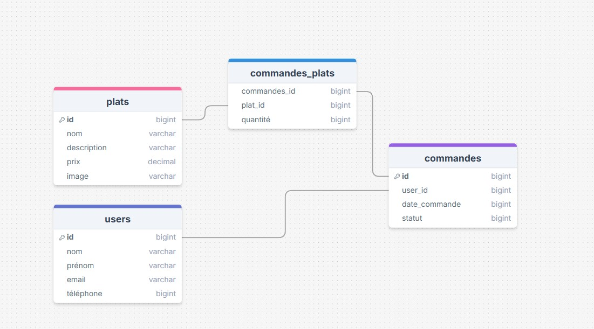

Durée du travail : 4 heures
Stack technique  
Express.js et node.js pour le back  
React pour le front (mais y aura-t-il du front vu le temps imaprti ?)  
Sequelize comme ORM  
PhpMyAdmin pour la BDD  

Schématisation des BDD
Table users  
Table plats  
Table commande  
Table commandes_plats = table de jointure car relation many to many (plusieurs commandes peuvent comporter le même plat et une commande peut comporter plusieurs plats)
  

Notes install environnement de dev
npm init -y //install node.js
npm install express // install express.js
